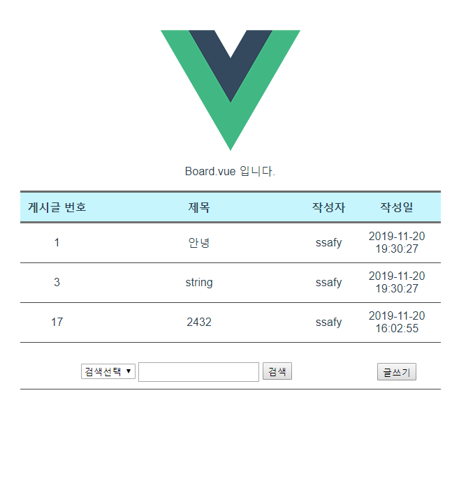
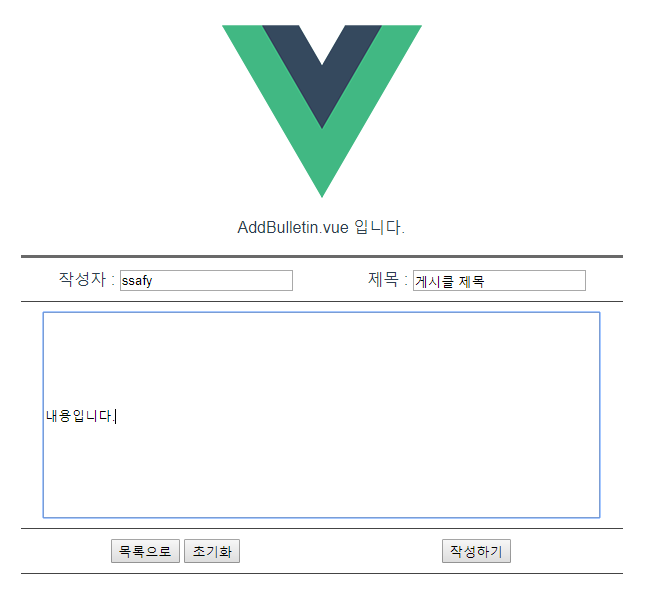
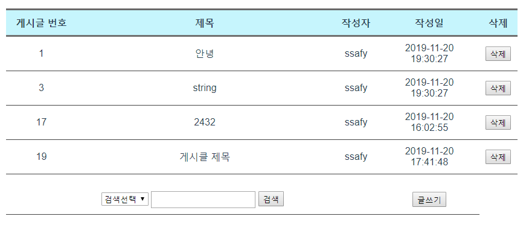
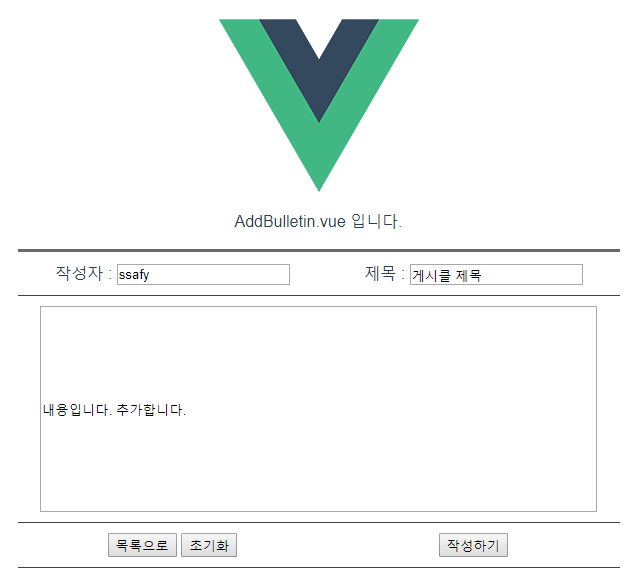
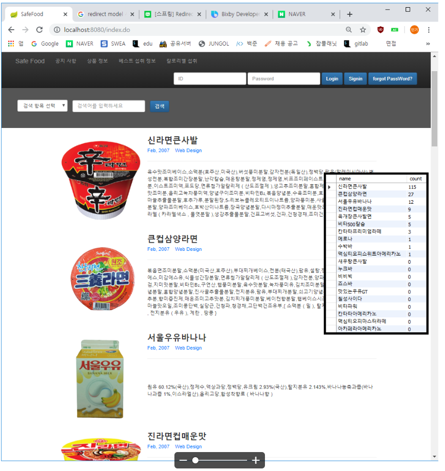
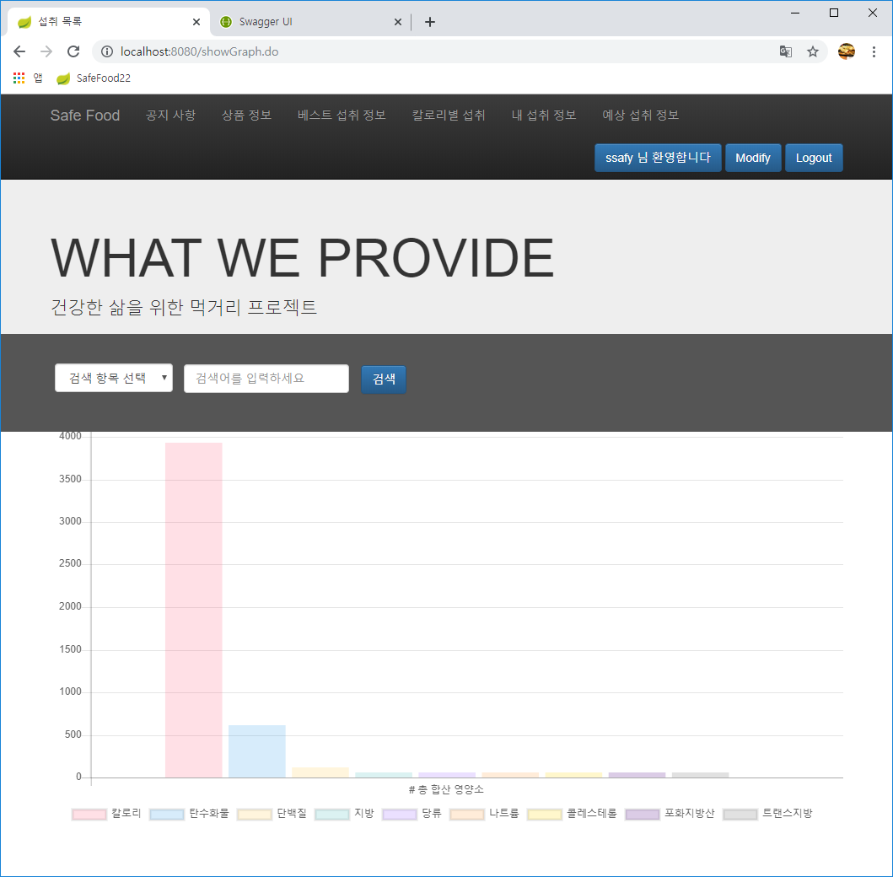
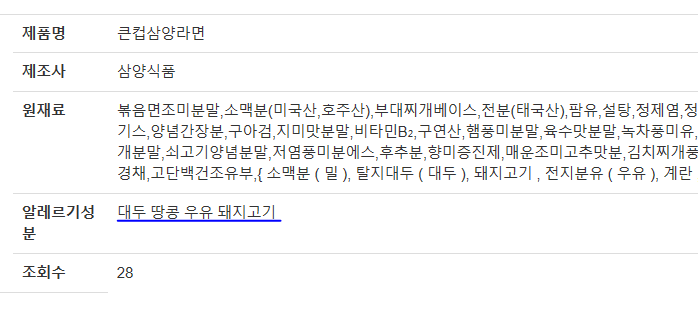
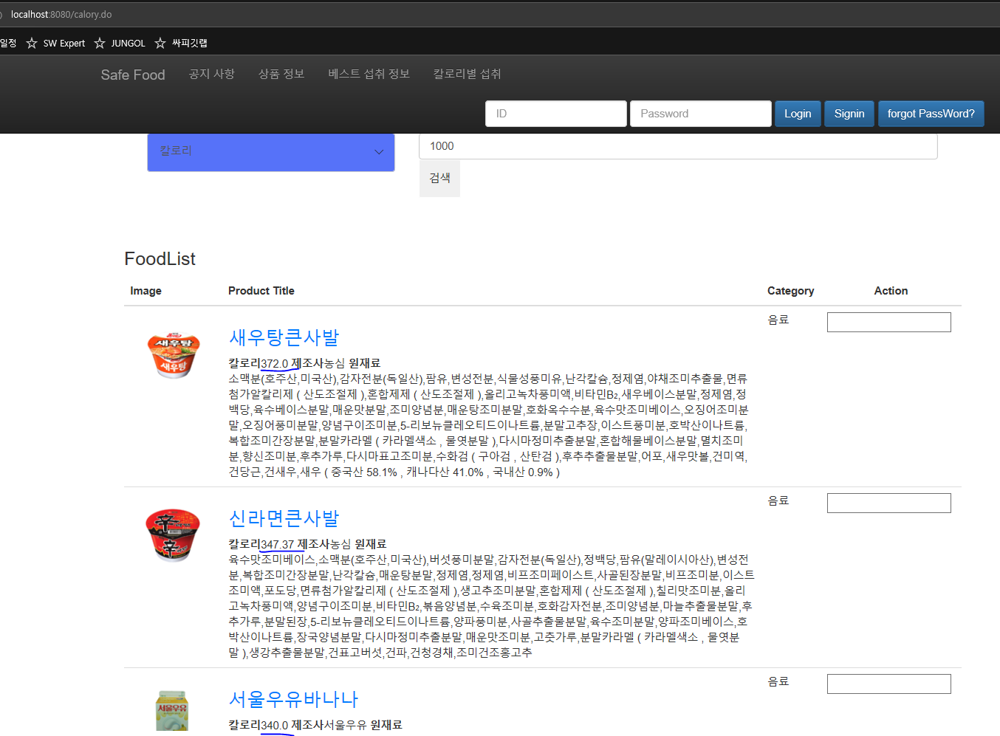

Spring SafeFood

> Spring SafeFood 이상민 김주희 강민기

## 구현한 기능들

|분류 | 구현기능                                                     | 점수 | 비고                                                         |
|---- | ------------------------------------------------------------ | ---- | ------------------------------------------------------------ |
|기본 | QnA 게시판 Vue를 적용한 웹페이지                             | 40   | 게시글 목록 - 10 게시글 등록 - 10 게시글 수정 - 10 게시글상세 검색 - 10 |
|기본 | 서버측 구현                                                  | 30   | 게시글 등록 - 10 게시글 수정 - 5 게시글 삭제 - 5 게시글 상세검색 - 5 게시글 목록 - 10 |
|추가 | 식품별 검색 빈도수, 섭취식품 CRUD                           | 10   |                                                              |
|심화 | 섭취식품 그래프화, 알레르기 성분 관리, 칼로리로 검색 시 그 칼로리와 가까운 조합 표시 | 15   |                                                              |

---

---

## 기본 기능

### QnA 게시판 Vue를 적용한 웹페이지 + 서버측 구현

| **게시글 목록**     |  |
| ------------------- | ------------------------------------------------------------ |
| **게시글 등록**     |  |
| **게시글 삭제**     |  |
| **게시글 수정**     |  |
| **게시글상세 검색** |  |

---

## 추가 기능

### 식품별 검색 빈도수

### 섭취식품 CRUD

---

## 심화 기능

### 섭취식품 그래프화

### 알레르기 성분 관리

### 칼로리로 검색 시 그 칼로리와 가까운 조합 표시

